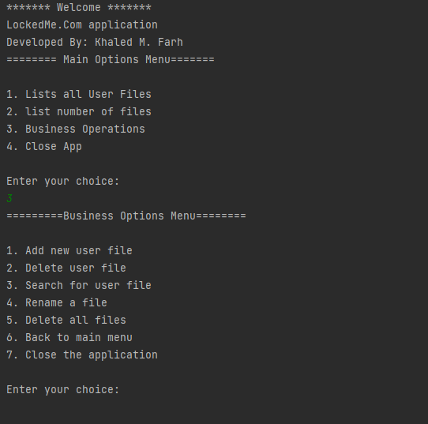

# FullStack Phase1 Assignment

# Scraping_BBC_website_getNews

## Project prospective 

### A distributed user Files database system stores and manage the user files like the following:
### The system consists of two main menus:

1.	The main menu: contains four options [1- 4]
•	List All Files in the database:
This feature is used to list down all the files in ascending order.
•	List the total number of the files in the database:
This feature is used to count and display the number of files in the database.
•	Business-Related Options:
This option navigates the user to a sub-menu that contains options
•	Close the app:
This option is to terminate the app

2.	Business-related options menu: this menu contains seven options [1-7]
•	Add new file:
This option is designed to take the file name and search for a file if it exists in the directory if not create a new file and add it to the database directory
•	Delete a file:
This option is designed to take the file name and search for a file if it exists in the directory and delete it,
•	Search for a file:
This option is designed to take the file name and search for it if it exists in the directory display it
•	Rename a file:
This option is designed to take the file name and file a new name and modify it to the new name
•	Delete all files: 
This option is designed to clear all the files from the data directory, before doing that it shows a warning to the user to make sure that he wants to delete all the files.
•	Navigate to the main menu:
This option is designed to navigate back to the main menu from the current menu
•	Close the app:
This option is designed to close the app from the business-related options menu 

## Output 

